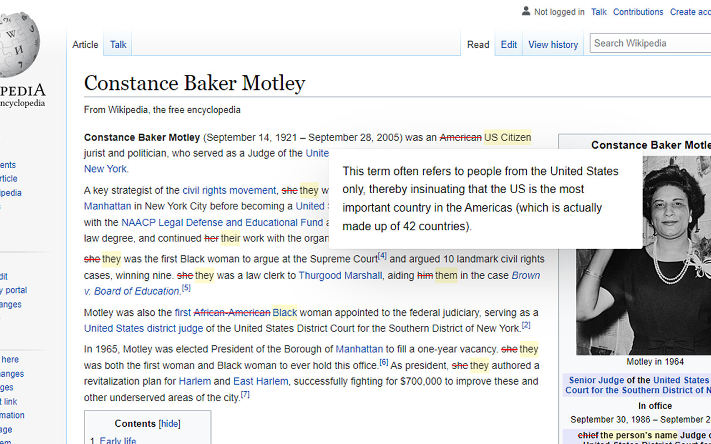
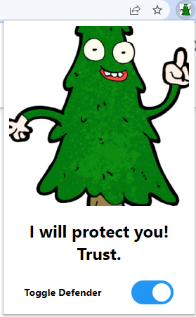

# Evergreen Defender

## I will Protect you! Trust :)

The Evergreen defender will replace harmful words and provide alternatives, and provide useful context on why the word must be eliminated from our lexicon.

# Installation and Usage:
Download the files and go to chrome://extensions
and turn on developer mode on the top right corner. Then load the files as an unpacked extension.

By clicking on the evergreen icon in the toolbar you can toggle the functionality for the chrome extension.

# Acknowledgements

This project uses James Padolsey's findAndReplaceDOMText.
Available at https://github.com/padolsey/findAndReplaceDOMText

The inspiration for this project as well as the word selection and descriptions are from Stanford University.